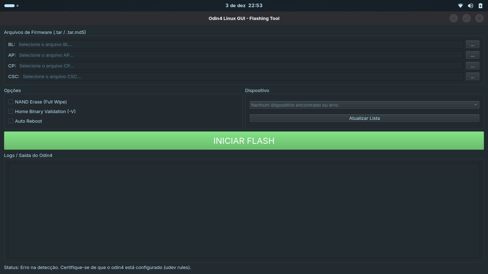

# odin4gui
Native Linux GUI for the odin4 Samsung flashing tool

## How does it work?

The executable provided in this repository is the result of combining Python code with the Odin4 executable; I only created the interface, as it's more user-friendly than a pure terminal.

## How to use it?

It's quite simple to use, it's just like the original Odin for Windows; you can place the AP, BL, CSC, etc. files in the corresponding fields and start the flashing process normally.

## How to do it?

First, go to the Releases tab and download the latest executable "odin4gui" and run it directly by right-clicking and choosing run, It might be necessary to grant execution permission first.

Another way to run it is by granting permission in the terminal and executing with `sudo`.

## Images

## Notice

> [!CAUTION]
> This tool is new and may have errors or bugs, so please don't blame me if there are any errors. If you find anything, feel free to submit an issue; it would be very helpful.

## Sources

Engine — [odin4 by Adrilaw](https://github.com/Adrilaw/OdinV4)

Interface — by me

## License

This project is licensed under the [MIT License](https://github.com/Llucs/odin4gui/blob/main/LICENSE)